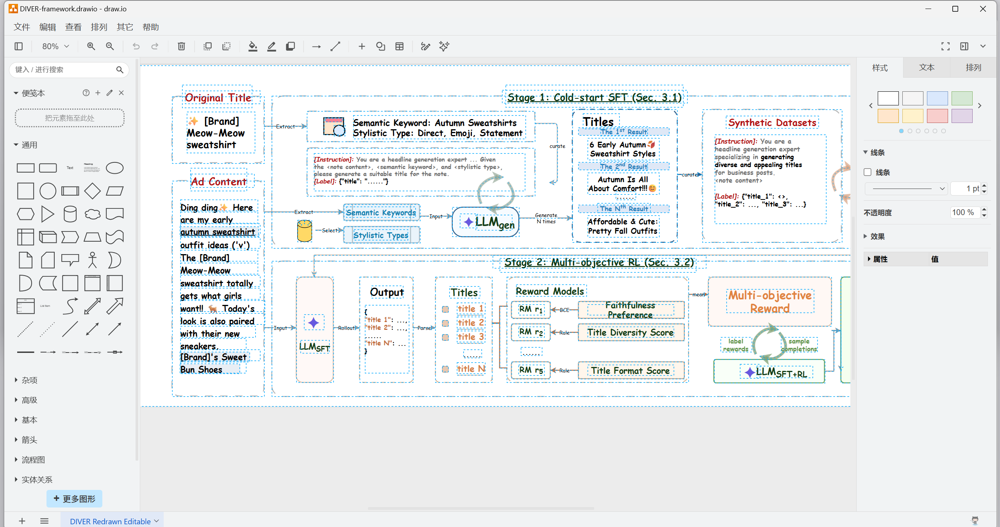
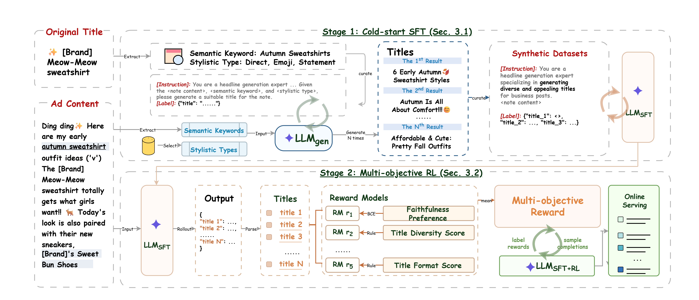

# Research Draw.io Diagram Skill

A portable agent skill for producing publication-style, editable diagrams.net / draw.io figures from papers, prompts, codebases, or screenshots.

```bash
npx skills add Will-hxw/drawio-diagram-builder-skill
```

> [中文版](README-cn.md)

## Prerequisites

| Requirement | Why |
|-------------|-----|
| **Python 3** (3.7+) | Preview and validation scripts |
| **Browser automation** (Playwright MCP, Puppeteer, browser tools, etc.) | Screenshot feedback loop — the skill is evidence-driven |
| **Internet access** | Preview loads `https://embed.diagrams.net/` |

Without browser automation the agent can still generate `.drawio` XML, but cannot visually verify the result. The iterative refinement loop is the skill's main value.

## Why This Exists

LLMs can write draw.io XML, but the first result is usually not right:

- text overlaps or escapes boxes
- arrows route incorrectly
- loop arrows look wrong
- icons are missing or inconsistent
- reference figures get embedded as images instead of redrawn as editable objects
- large diagrams crash on Windows with long-URL failures

This skill gives the agent a repeatable workflow: create editable XML → preview through a local URL (not a giant encoded one) → screenshot → fix visible defects → repeat → validate.

## Example Output





## What It Does

- Recreates paper figures as editable draw.io objects
- Draws method overviews from research papers
- Converts repositories into architecture/data-flow diagrams
- Creates ML pipeline diagrams (stages, models, datasets, training loops)
- Iteratively polishes typography, colors, arrows, icons, spacing

## What It Doesn't

- It is not a draw.io replacement or affiliated with diagrams.net / JGraph
- It doesn't guarantee one-shot perfection — high-fidelity reproduction takes multiple screenshot-feedback passes

## Repository Layout

```text
.
├── skills/drawio-diagram-builder/    # Agent skill (discovered by npx skills add)
│   ├── SKILL.md                      # Main workflow
│   ├── agents/openai.yaml
│   ├── references/
│   │   ├── drawio-workflow.md
│   │   └── xml-authoring.md
│   └── scripts/
│       ├── make_drawio_preview.py
│       ├── serve_drawio_preview.py
│       └── validate_drawio.py
├── assets/                           # README images
├── examples/minimal.drawio
├── tests/smoke_test.py
├── README.md
└── LICENSE
```

## Manual Install (without npx skills)

### Claude Code

```bash
git clone https://github.com/Will-hxw/drawio-diagram-builder-skill.git
cp -R drawio-diagram-builder-skill/skills/drawio-diagram-builder ~/.claude/skills/
```

### Codex

**Windows:**

```powershell
git clone https://github.com/Will-hxw/drawio-diagram-builder-skill.git
New-Item -ItemType Directory -Force "$env:USERPROFILE\.codex\skills" | Out-Null
Copy-Item -Recurse -Force .\drawio-diagram-builder-skill\skills\drawio-diagram-builder "$env:USERPROFILE\.codex\skills\"
```

**macOS / Linux:**

```bash
git clone https://github.com/Will-hxw/drawio-diagram-builder-skill.git
mkdir -p "$HOME/.codex/skills"
cp -R drawio-diagram-builder-skill/skills/drawio-diagram-builder "$HOME/.codex/skills/"
```

Restart the agent after copying.

## Example Prompts

```text
Use $drawio-diagram-builder to read this paper section and create an editable draw.io method overview.
```

```text
Use $drawio-diagram-builder to reproduce this reference figure as editable draw.io XML. Preview locally, screenshot, compare, and iterate.
```

```text
Use the drawio-diagram-builder skill in this repository to draw a system architecture diagram from the codebase.
```

## Helper Scripts

All scripts are plain Python 3 — no pip packages needed.

### Validate a `.drawio` file

```powershell
python .\skills\drawio-diagram-builder\scripts\validate_drawio.py .\examples\minimal.drawio
```

Flags embedded raster images by default. Use `--allow-raster` only when image assets are intentional.

### Generate + serve preview in one command

```powershell
python .\skills\drawio-diagram-builder\scripts\serve_drawio_preview.py .\examples\minimal.drawio --port 8765
```

Opens `http://127.0.0.1:8765/drawio-preview.html` in your browser.

### Generate preview HTML only

```powershell
python .\skills\drawio-diagram-builder\scripts\make_drawio_preview.py .\examples\minimal.drawio --out .\drawio-preview.html
python -m http.server 8765 --bind 127.0.0.1
```

Then open `http://127.0.0.1:8765/drawio-preview.html?rev=1`.

The preview uses an iframe to `https://embed.diagrams.net/` and injects XML via `postMessage` — the browser URL stays short, avoiding the Windows long-URL crash.

## Windows Notes

- Large `.url` shortcuts with encoded draw.io URLs crash on Windows. Use the preview scripts instead.
- The preview's blue Save button downloads a `.drawio` file — it cannot overwrite the local source (browser sandbox). Move it back manually.
- Run servers on `127.0.0.1` (not `localhost`) to avoid IPv6 resolution delays.

## Smoke Test

```powershell
python .\tests\smoke_test.py
```

Verifies XML parsing, preview HTML generation, and that the output contains the diagrams.net iframe.

## License

MIT. See [LICENSE](LICENSE).
